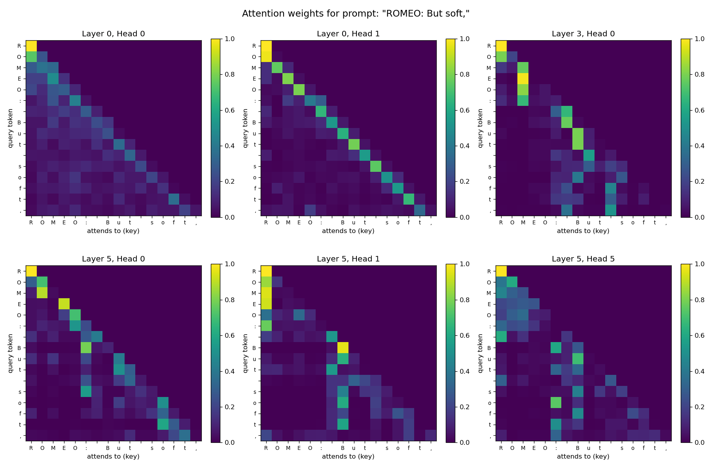

# nanoGPT-from-scratch — A Character-Level Transformer

A GPT-style language model built **from scratch in PyTorch**, one concept at a
time — from raw text all the way to a working decoder-only Transformer that
generates Shakespeare. This repo is structured as a **learning progression**:
each numbered script introduces exactly one idea, and every idea is explained in
[`documentation.md`](documentation.md).

> Built to *understand* transformers, not just use them — every component
> (tokenization, batching, self-attention, multi-head attention, residuals,
> layer norm, positional embeddings) is implemented and explained line by line.

---

## Result

Trained on ~1M characters of Shakespeare, from nothing but next-character
prediction:

| Model | Params | Val loss | vs. baseline |
|-------|--------|----------|--------------|
| Bigram baseline | — | 2.47 | (floor: 1 char of context) |
| GPT (Part 5) | 2.72 M | 1.63 | learns structure |
| **GPT scaled up (Part 7)** | **10.76 M** | **1.50** | readable Shakespeare |

Sample from the scaled-up model:

```
KING EDWARD IV:
That, and my might broad freeds and thence be she,
On lest unchild; and he hath done to bring it.

WARWICK:
Not this news, noble counsel of heaven cure!
What is he slander said my tarry, then the
time should be present shrived to the hour, and forth
As I crown, thus it bear of another be much;
```

It learns the `SPEAKER:` play format, character names, English rhythm, and mostly
real words — the remaining invented spellings (`freeds`) are the character-level
ceiling, fixed by subword tokenization. (Samples in
[`sample_output.txt`](sample_output.txt) / [`sample_big.txt`](sample_big.txt).)

---

## The progression

| # | Script | Concept |
|---|--------|---------|
| 1 | [`01_tokenizer.py`](01_tokenizer.py) | Char-level tokenization: text ↔ integers |
| 1 | [`02_data.py`](02_data.py) | Encode the corpus to a tensor, train/val split |
| 2 | [`03_batching.py`](03_batching.py) | Context windows & the `(batch, time)` tensor |
| 2 | [`04_bigram.py`](04_bigram.py) | Bigram baseline + the full training loop |
| 3 | [`05_attention_intuition.py`](05_attention_intuition.py) | The math trick: masked weighted-average → softmax |
| 3 | [`06_self_attention.py`](06_self_attention.py) | Single-head self-attention (query/key/value) |
| 4 | [`07_transformer_block.py`](07_transformer_block.py) | Multi-head attention, FFN, residuals, layer norm |
| 5 | [`08_gpt.py`](08_gpt.py) | Full GPT: positional embeddings, stacked blocks, training |
| 6 | [`09_sampling.py`](09_sampling.py) | Temperature & top-k sampling, prompted generation |
| 6 | [`10_visualize_attention.py`](10_visualize_attention.py) | Extract & plot attention heatmaps |
| 7 | [`11_train_bigger.py`](11_train_bigger.py) | Scale up (10.76M params) + best-checkpoint saving |

Scripts 1–8 are self-contained; the Part 6 scripts load a saved checkpoint via
the reusable model in [`gpt_model.py`](gpt_model.py). Read the matching section
in [`documentation.md`](documentation.md) alongside the code.

### Seeing attention learn

Attention weights from the trained model on the prompt `"ROMEO: But soft,"`.
Every map is lower-triangular (a token can't attend to the future), and different
heads specialize — some attend to the previous token, others to word-starts or
punctuation:



---

## How the model works (one paragraph)

Text is tokenized into integers, one per character. Each token is turned into a
vector by summing a **token embedding** (what it is) and a **positional
embedding** (where it is). These flow through a stack of **Transformer blocks**,
each of which does two things: **multi-head self-attention** (tokens look back at
earlier tokens and pull in relevant information, causally masked so they never
see the future) followed by a per-token **feed-forward network**. Every sublayer
is wrapped in a **residual connection** with **pre-layer-norm** for stable, deep
training. A final linear head produces a probability distribution over the next
character, trained with **cross-entropy loss** and the **AdamW** optimizer. This
is the same decoder-only architecture as GPT-2/3, just small.

```
tokens → token_emb + pos_emb → [ Block: attention → feed-forward ] × N → LayerNorm → logits
```

---

## Quickstart

```bash
# Requires Python 3 + PyTorch (a CUDA GPU is used automatically if present)
pip install torch

# Walk the progression (each prints output you can inspect):
python3 01_tokenizer.py
python3 04_bigram.py        # trains the baseline
python3 06_self_attention.py

# Train the full GPT (writes sample_output.txt and ckpt.pt):
python3 08_gpt.py

# Part 6 — explore the trained model (needs ckpt.pt from the step above):
python3 09_sampling.py            # temperature / top-k / prompted generation
python3 10_visualize_attention.py # writes attention.png
```

> Part 6 scripts need `matplotlib` for the heatmap: `pip install matplotlib`.

The dataset ([`input.txt`](input.txt)) is the "Tiny Shakespeare" corpus
(~1.1M characters, 65 unique tokens).

---

## Key concepts demonstrated

- **Self-attention** from first principles — built up from plain averaging to
  scaled dot-product query/key/value attention
- **Causal masking** — lower-triangular mask so a token attends only to the past
- **Multi-head attention** — parallel heads capturing different relationships
- **Residual connections & layer norm** — what makes deep stacks trainable
- **Positional embeddings** — injecting order into a permutation-invariant model
- **The training loop** — forward → cross-entropy loss → backprop → optimizer step
- **Autoregressive generation** — sampling text one token at a time
- **Regularization & evaluation** — dropout, held-out validation loss

See the **interview-style FAQ** in [`documentation.md`](documentation.md) for
concise answers to "why did you design it this way?" questions on every component.

---

## Tech

Python · PyTorch · a single GPU (or CPU). No high-level transformer libraries —
`nn.Linear`, `nn.Embedding`, `nn.LayerNorm` and tensor ops only.

## Credits

The architecture and Tiny Shakespeare dataset follow Andrej Karpathy's nanoGPT /
"Let's build GPT" work; this repo is a from-scratch reimplementation built for
understanding, with extensive per-step documentation. The design traces back to
Vaswani et al., *"Attention Is All You Need"* (2017).
